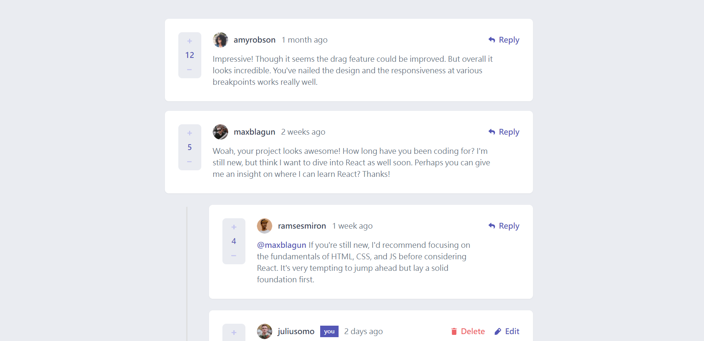
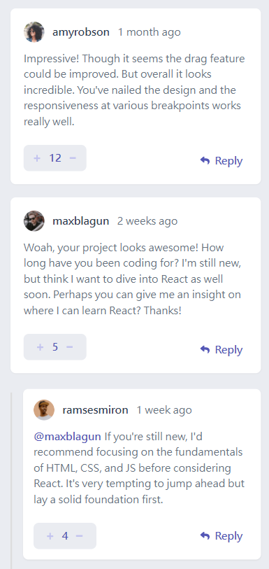

# Frontend Mentor - Interactive comments section solution

This is a solution to the [Interactive comments section challenge on Frontend Mentor](https://www.frontendmentor.io/challenges/interactive-comments-section-iG1RugEG9). Frontend Mentor challenges help you improve your coding skills by building realistic projects.

## Table of contents

- [Overview](#overview)
  - [Screenshot](#screenshot)
  - [Links](#links)
- [My process](#my-process)
  - [Built with](#built-with)
- [Author](#author)

**Note: Delete this note and update the table of contents based on what sections you keep.**

## Overview

### Screenshot

**_Desktop_**

**_Mobile_**

### Links

- Solution URL: [Repo](https://github.com/yuenu/interactive-comments)
- Live Site URL: [Live demo](https://interactive-comments-ee00d.web.app/)

## My process

### Built with

- Semantic HTML5 markup
- Flexbox
- Desktop-first workflow
- [React](https://reactjs.org/) - JS library
- [tailwindcss](https://tailwindcss.com/) - css framework
- [Redux Toolkit](https://redux-toolkit.js.org/) - global state management

## Author

- Website - [yuenu](https://yuenu.github.io/profile/)
- Frontend Mentor - [@yuenu](https://www.frontendmentor.io/profile/yuenu)
